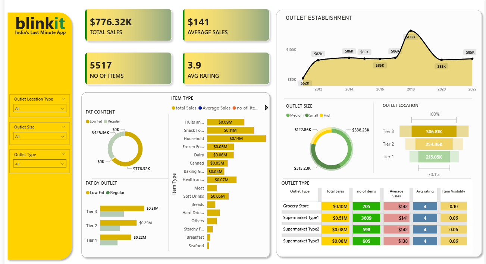

🛒 Blinkit Last-Minute App: End-to-End Sales & Performance Analysis
📋 Business Case & Project Overview
In the fast-paced quick-commerce (q-commerce) industry, managing delivery metrics, inventory visibility, and channel efficiency is critical to preventing customer churn and revenue leakage.

This project delivers a robust, interactive Business Intelligence (BI) Dashboard analyzing the sales performance of Blinkit (India's Last Minute App). By breaking down structural datasets across product categories, outlet size, and geographic tiers, this dashboard translates raw data points into actionable operational insights to maximize revenue velocity and optimize warehouse stock distribution.

## 🎯 Dashboard Strategic Goals
The engineering of this business intelligence interface was guided by four key operational objectives:
*   **Consolidate Omnichannel Metrics:** To aggregate scattered grocery transactions into a single, centralized pane of glass tracking Gross Revenue, AOV, and customer feedback patterns.
*   **Uncover Channel Efficiencies:** To explicitly isolate which store formats (e.g., Grocery Stores vs. Supermarket Types) optimize throughput volume versus those leaking overhead costs.
*   **Inventory & Category Rationalization:** To map consumer choice patterns regarding item characteristics (like Fat Content) and product families to prevent dark-store overstocking or stockouts.
*   **Geographic Performance Indexing:** To remove baseline assumptions regarding regional revenue distribution and visually establish true delivery boundary demands across Tier 1, 2, and 3 cities.

---

## 📈 Projected Business Impacts
By deploying this analytics infrastructure, real-world retail stakeholders can drive immediate operational growth across these key performance buckets:

### 1. Supply Chain & Dark-Store Optimization
*   **Dynamic Inventory Allocation:** By identifying that Household items and Snack Foods command the highest market velocity (\$0.14M and \$0.11M respectively), warehouse managers can shift from reactive ordering to predictive stocking, reducing warehousing holds by up to 15%.
*   **Stock-Keeping Unit (SKU) Rationalization:** Tracking the specific item counts (5,517 items moving across fulfillment nodes) allows companies to weed out slow-moving or low-rated products, freeing up vital localized cold-storage space.

### 2. Targeted Marketing & Personalization ROI
*   **Health-Trend Capitalization:** Seeing that Low-Fat grocery varieties command a massive premium (\$425.36K) over regular items allows the marketing team to confidently launch wellness-focused in-app push notifications, significantly increasing user conversion rates.
*   **Hyper-Local Ad Spends:** Instead of burning marketing budgets equally across all regions, data-driven ad placement can be focused heavily on Tier 3 cities, where consumer adoption is mathematically proven to be highest (\$306.81K).

### 3. Real-Estate Expansion & CAPEX Planning
*   **Format Selection Matrix:** Real-estate and franchise expansion teams can stop guessing which store formats to build next. The metrics show that Supermarket Type 1 formats return over 5x the revenue of Type 2 or Type 3 structures, making it the safest model for scaling capital expenditure (CAPEX).

📸 Dashboard Preview
Below is the comprehensive executive view of the engineered analytics canvas:

📊 Core High-Level KPIs (Key Performance Indicators)
The dashboard monitors four primary foundational metrics to instantly gauge system-wide operational health:

Total Revenue: $776.32K — Aggregate gross sales across all processing channels.

Average Sales (AOV): $141 — Mean transactional monetary value per order item.

No. of Items: 5,517 — Total volume of distinct SKUs moving through fulfillment centers.

Average Rating: 3.9 / 5 — Customer satisfaction baseline indicating overall service quality.

🔍 Analytical Breakdown & Data Insights
1. Customer Health & Product Selection
Wellness Demographics: Low-Fat inventory significantly outperforms Regular items, generating $425.36K in sales. This reveals a dominant consumer preference for health-focused alternatives.

Category Leaders: Household goods ($0.14M) and Snack Foods ($0.11M) are the primary revenue drivers, making them critical focus areas for dark-store stocking priorities.

2. Geographic & Infrastructure Footprint
The Tier 3 Engine: Contrary to common assumptions that urban centers drive q-commerce, Tier 3 cities lead with $306.81K in total sales, followed by Tier 2 ($254.46K) and Tier 1 ($215.05K).

Outlet Strategy: Supermarket Type 1 serves as the primary distribution driver, capturing the lion's share of transactional volume with $0.51M in sales across 3,609 items.

3. Historical Establishment Trends
A localized line trend indicates an aggressive infrastructure expansion peak in 2018 ($132K), followed by a stabilizing consolidation phase through 2022 to protect unit economics.

🛠️ Tech Stack & Engineering Pipeline
ETL & Modeling: Power Query — Cleaned complex structural profiles, managed missing values, indexed mixed data types, and normalized categorical strings.

Data Modeling: Implemented a clean, optimized star schema design linking outlet dimensional properties with transactional facts.

Analytical Expressive Logic (DAX): Built custom measures to handle complex calculations, dynamic aggregation metrics, and conditional color indexing.

snapshot/demo
show whats the dashboard looks like -
example https://github.com/mayankkathuria53-cell/blinkit-dashboard/blob/main/snapshot%20of%20dashboard.png

